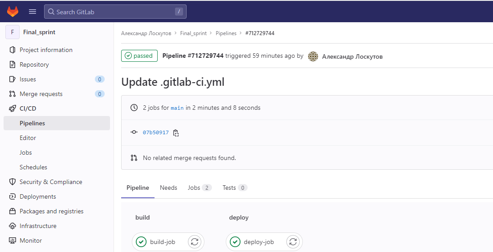
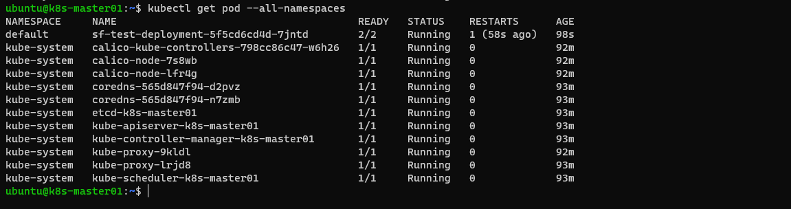
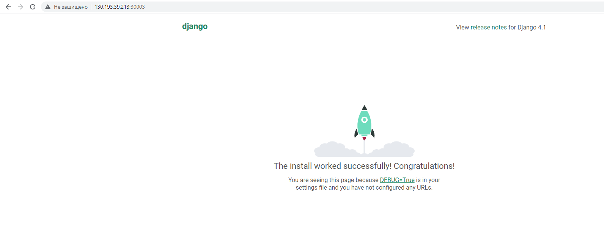

# Спринт 2
**GitLab деплой приложения**
___
Как развернуть:
- создать _Personal Access Token_, указать области - api, read_registry, write_registry
- импортировать содержимое _/gitlab/deploy/_ в созданный ранее проект (final_sprint) на gitlab.com
- указать логин вашей учётной записи gitlab.com в соответствующем поле файла _templates/deployment.yml_
  - _image: "registry.gitlab.com/<Указать логин аккаунта GitLab>/final_sprint:latest"_
- указать внешний ip-адрес worker-ноды соответствующем поле файла _app/app/settings.py_, ip-адрес необходимо указывать в одинарных кавычках
  - ALLOWED_HOSTS = ['ip-адрес worker-ноды']
- вручную запустить исполнение пайплайна CI/CD, ввести при запуске логин и пароль вашей учётной записи gitlab.com
___
**Результат развертывания**
- Результат выполения пайплайна
- 
- Терминал
- 
- Доступ через веб (ip-адрес worker-ноды:30003)
- 
___
- Проект на gitlab - https://gitlab.com/alexlosk79/final_sprint
___
**P.S.** Из спринта - _**По возможности** нужно реализовать сборку из тегов в Git, где тег репозитория в Git будет равен тегу собираемого образа._
Прочитано - Как не обязательно ))
