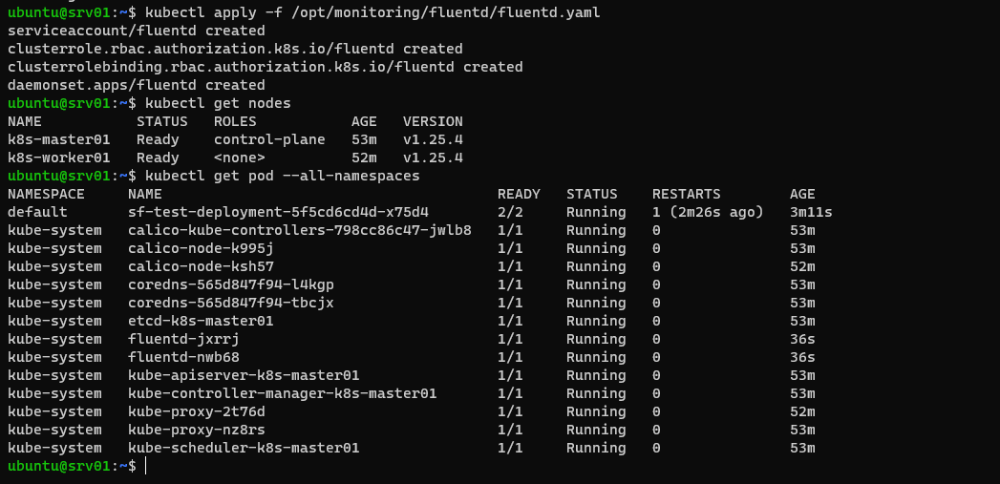
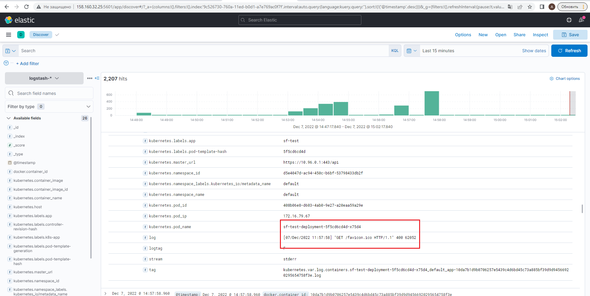
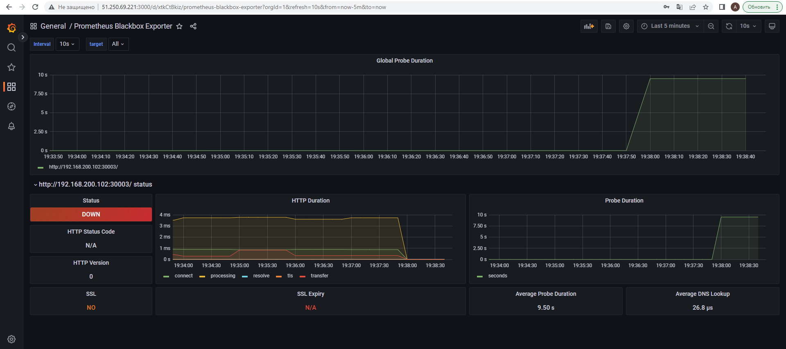
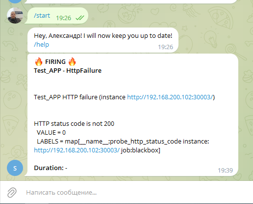
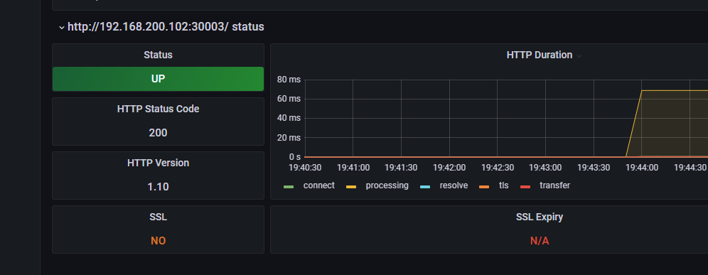
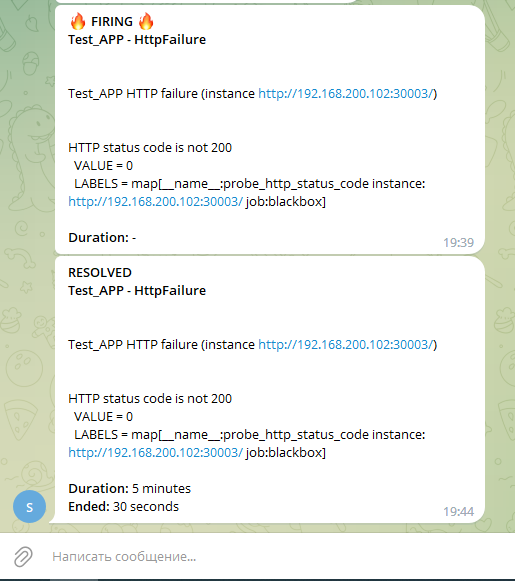

# Спринт 3
**Логирование, мониторинг, алертинг**
___
Требования:
- Настроенный телеграм бот, для приема алертов
___
Как развернуть:
- зайти на сервер (**srv01**) через терминал
- **1. Логирование**
- установить elasticsearch
  - _echo "deb [trusted=yes] https://mirror.yandex.ru/mirrors/elastic/7/ stable main" | sudo tee /etc/apt/sources.list.d/elastic-7.x.list_
  - _sudo apt install elasticsearch_
  - _sudo systemctl enable elasticsearch_
- изменить параметры в файле _/etc/elastisearch/elaticsearch.yml_ на
  - **network.host: 192.168.200.11**
  - **discovery.seed_hosts: ["192.168.200.101", "192.168.200.102"]**
  - добвавить в конец файла **xpack.security.enabled: false**
 - выполнить _systemctl restart elasticsearch_
 - установить kibana
   - _sudo apt install kibana_
   - _sudo systemctl enable kibana_
 - изменить параметры в файле _/etc/kibana/kibana.yml_
   - **server.host: "0.0.0.0"**
   - **elasticsearch.hosts: ["http://192.168.200.11:9200"]**
- выполнить _systemctl restart kibana_
- выполнить команду _kubectl apply -f /opt/monitoring/fluentd/fluentd.yaml_
- в браузере перейти в Кибану по адресу http://<внешний адрес>:5601
  - создать новый index pattern - _logstash-*_
  - перейти в Discover
- **2. Мониторинг и алертинг**
- в файле _/opt/monitoring/docker-compose.yml_ вставить свои значения
  - _TELEGRAM_ADMIN: "0000000"_
  - _TELEGRAM_TOKEN: 0000000:sdhclisdh_
- под рутом выполнить _docker-compose -f /opt/monitoring/docker-compose.yml up -d_
- проверить состояние контейнеров - _docker ps_
- в браузере перейти в Графану по адресу http://<внешний адрес>:3000
- сменить пароль в Графане
- настроить data soures: 
  - добавить новый data sources - Prometheus, 
  - в разделе HTTP, в поле URL, прописать - _http://prometheus:9090_
  - сохранить
  - импортировать дашбоард - id 1860 (показывает состояние srv01)
  - импортировать дашбоард - id 7587 (показывает состояние нашего приложения)
 - перезапустить бота и наслаждаться результатом ))
 
 Конфиги сервисов находятся [***тут***](/terraform/deploy/monitoring)
 ___
 **Результат развертывания**
 - Терминал (fluentd)
 - 
 - Kibana Discover
 - 
 - Терминал (monitoring stack)
 - 
 - Grafana dashboard 1860
 - 
 - Grafana dashboard 7587
 - 
 - Grafana dashboard при падении приложения
 - 
 - Telegram bot при падении приложения
 - 
 - Grafana dashboard при восстановлении приложения
 - 
 - Telegram bot при восстановлении приложения
 - 
