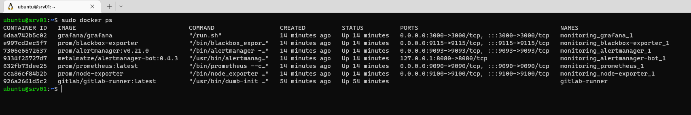
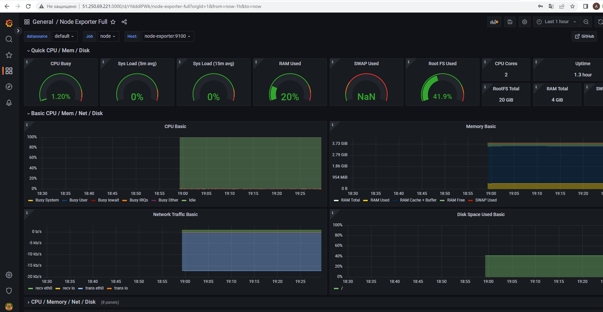
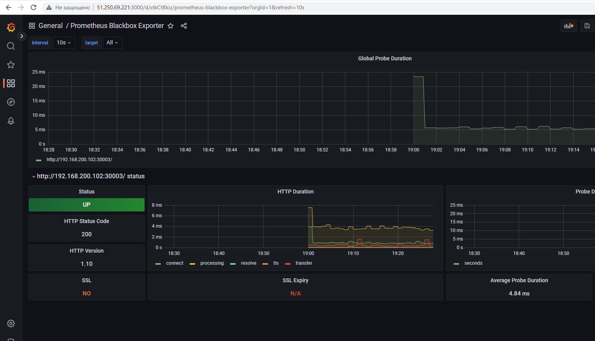

# Спринт 3
**Логирование, мониторинг, алертинг**
___
Требования:
- Настроенный телеграм бот, для приема алертов
___
Как развернуть:
- зайти на сервер (**srv01**) через терминал
- в файле _/opt/monitoring/docker-compose.yml_ вставить свои значения
  - _TELEGRAM_ADMIN: "0000000"_
  - _TELEGRAM_TOKEN: 0000000:sdhclisdh_
- под рутом выполнить _docker-compose -f /opt/monitoring/docker-compose.yml up -d_
- проверить состояние контейнеров - _docker ps_
- в браузере перейти в Графану по адресу http://<внешний адрес>:3000
- сменить пароль в Графане
- настроить data soures: 
  - добавить новый data sources - Prometheus, 
  - в разделе HTTP, в поле URL, прописать - _http://prometheus:9090_
  - сохранить
  - импортировать дашбоард - id 1860 (показывает состояние srv01)
  - импортировать дашбоард - id 7587 (показывает состояние нашего приложения)
 - перезапустить бота и наслаждаться результатом ))
 
 Конфиги сервисов находятся [***тут***](/terraform/deploy/monitoring)
 ___
 **Результат развертывания**
 - Терминал
 - 
 - Grafana dashboard 1860
 - 
 - Grafana dashboard 7587
 - 
 
  
