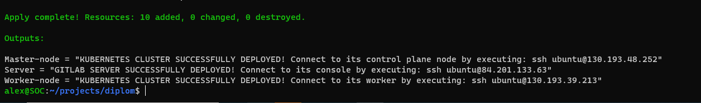
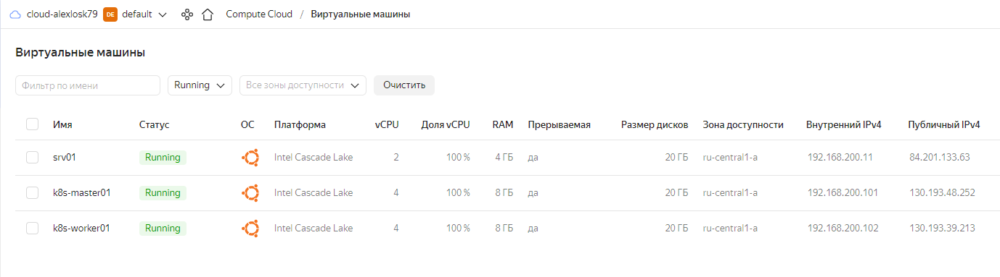
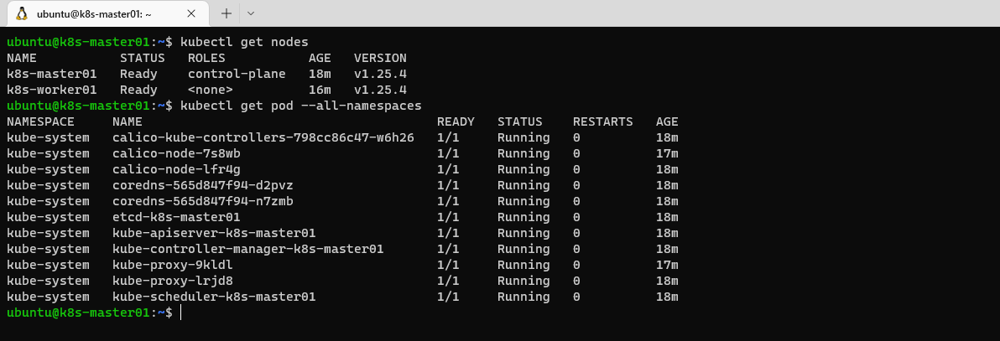
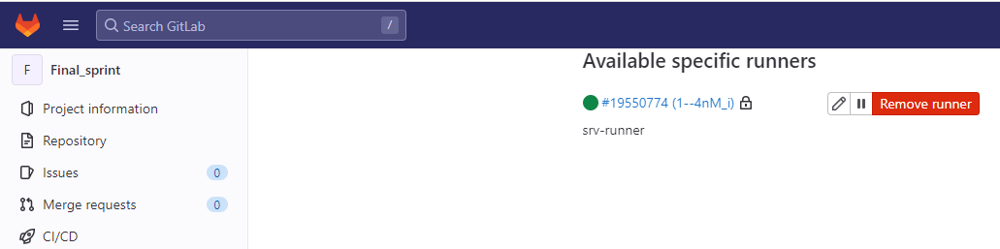

# Спринт 1
**Развертывание в Яндекс Облаке**
___
Требования:
- Аккаунт в Яндекс Облаке
- Аккаунте в gitlab.com
- Установленный Terraform
- Установленный Ansible
___
Как развернуть:
- загрузить содержимое из удаленного репозитория
- перейти в каталог: _/terraform/deploy/_
- в файле **main.tf** внести свои значения:  
  - _token     = "***Specify OAuth token***"_
  - _cloud_id  = "***Specify Cloud ID***"_
  - _folder_id = "***Specify Folder ID***"_
- в файле **variables.tf** прописать свой приватный и публичный ключ:
  - _private_key = "~/.ssh/id_*"
  - _pub_key     = "~/.ssh/id_*.pub"
- в файле **gitlab-token.yml** прописать регистрационный токен:
  - _gitlab_token: "***Specify GitLab runner registration token***"_
- сделать файл **provisioning.sh** исполняемым
- выполнить _terraform init_
- выполнить _terraform apply_
___
**Результат развертывания**
- Терминал
- 
- Яндекс Облако
- 
- Мастер-нода
- 
- GitLab runner
- 
